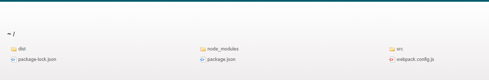

问题描述：我不能每次改完代码都去 **npm run dev**


解决：

配置webpack的自动打包功能：

1. 安装自动打包工具： webpack-dev-server
> npm install webpack-dev-server -D

2. 修改package.json -> script中的dev命令

>script节点下的脚本，可以通过npm run 执行
```
"scripts": {
    "test": "echo \"Error: no test specified\" && exit 1",
    "dev": "webpack-dev-server"   
  },
```

3. 将src -> index.html中，script脚本引用路径改为 /bundle.js

4. 运行 npm run dev 命令重新进行打包

5. 在浏览器中访问  http://localhost:8080/  或者 http://192.168.0.104:8080/

bundle.js是隐藏在内存中的，并不是实际存在的

- webpack-dev-serve 会启动一个实时打包的http服务器   
- webpack-dev-serve 打包生成的输出文件，默认放到了项目根目录中，而且是虚拟的看不见的


思考：
其实按照如上配置，在webpack4的版本是可以看到一个，类似于服务器文件夹的一个页面，选中src就可以看到也main，但是在此处5.x的版本中就不行了，对于webpack默认的文件名称，以及路径其实很迷的
但是如果在这个步骤中想要看到页面，可以在webpack.config.js文件中增加配置，也可以直接借助插件生成预览画面，参考5、的markdown
```
devServer: {
  static: "./src"
 }
```
其实下面这样写就对了,可以达到预期的看到服务器上所有文件夹的效果
bundle.js果然存在与内存中,实时更新并看不到
```
devServer: {
  static: "./"
 }
 以上配置告知 webpack-dev-server，将 './' 目录下的文件 serve 到 localhost:8080 下(寄存到服务器下)，就可以如下图了
 ```

