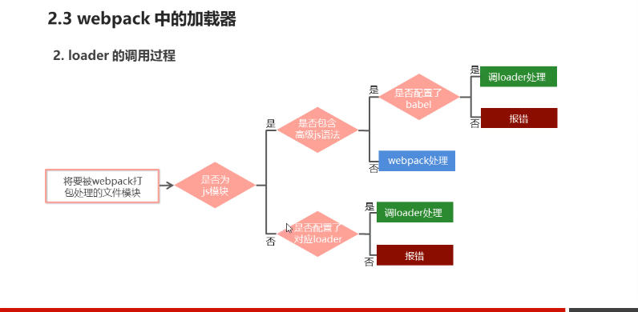

webapck中的加载器

loader打包非js模块

>在实际开发过程中，webpack默认只能打包处理以.js后缀结尾的模块，非.js后缀结尾的模块webpack默认处理不了，需要调用loader加载器才可以正常打包，否则会报错。

> loader加载器可以协助webpack打包处理特定的文件模块，
eg: 
1、less-loader可以打包处理 .less相关的文件
2、sass-loader可以打包处理 .scss相关的文件
3、url-loader 可以打包处理css中与url路径相关的文件

laoder的调用过程

>工具小结: babel 是将es6转换为es5，可以把高级的有兼容性的javascript代码转换为低级的没有兼容性的代码

webpack默认打包处理以.js后缀结尾的模块，那就要借助加载器处理非.js结尾的模块
