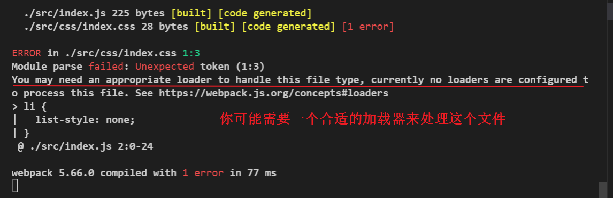
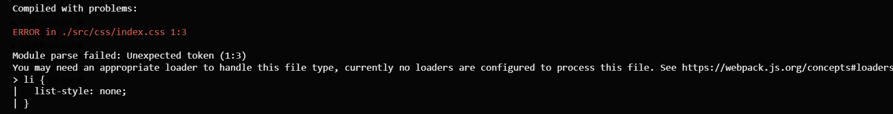

直接在项目里使用css会报错(在index.js里直接import进一个css文件回报如下的错误)



------------------------------




处理过程，引入css加载器过程：
1. 运行 **npm i style-loader css-loader -D** 命令，安装处理css文件的loader

2. 在webpack.config.js的module -> rules数组中，添加loader规则如下（加载器对应的是规则）
```
// 所有第三方文件模块的匹配规则
 rules: [
      {
        test: /\.css$/,
        use: [
          { loader: 'style-loader' }, // creates style nodes from JS strings
          {
            loader: 'css-loader',  //translates CSS into CommonJS
            options: {
              modules: true
            }
          }
        ]
      }
    ],
//其中test表示匹配的文件类型(此处表示以css结尾的文件类型)，
//use表示对应要调用的loader  loader顺序是固定的。多个loader的调用方式是从后往前调用

// 一切以官方网站标准为准，看官方的加载器使用方式，在其它网站看到的难免会有落后的嫌疑（也就是版本号不一样，相关的用法其实是已经发生了改变的）
```